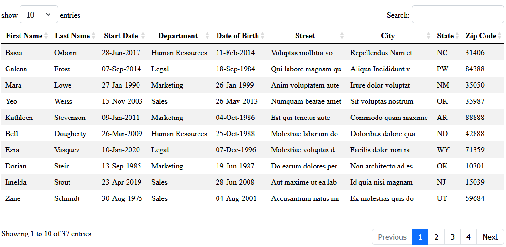

# data-table-react



A react component that display data in a table with features.
Pagination, search, sorting.

## Prerequisites

- NodeJS [(version 12.18 or newer)](https://nodejs.org/en/)
- A code editor like [VSCode](https://code.visualstudio.com/)

## Installation

```
npm install @jpotin/data-table-react
```

Once installed, import the "DataTable" component

```
import DataTable from "@jpotin/data-table-react"
```

You can import the css

```
import "@jpotin/data-table-react/dist/style.css"
```

## Usage

The component takes a unique prop data

```
<DataTable prop={value} />
```

The value is an object, or a function that return an object in the shape of:

```
{
  labels:
  [
    { title: "string", data: "<data>" },
    ...
  ],
  entries:
  [
    { <data>: "string" }
    ...
  ]
}
```

Additionaly you can add the initial sorting options like such

```
sortBy: "<data>",
sortDirection: "asc" or "desc",
```
